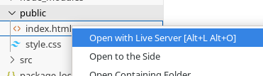

# How to configure a Tailwind server with nodejs

Remember, that is the basic configuration, with the basic adjustments and recommendations.

## Tailwindcss references

- **The base documentation** - [tailwindcss.com/docs/installation](https://tailwindcss.com/docs/installation)

- **Youtube video** - [How to Setup Tailwind CSS in VS Code?](https://youtu.be/SPr-1cwVn1k)

## Basic

### Dependencies

First install [nodejs](https://nodejs.org/en)

`sudo dnf install nodejs`

### VS code extensions

[Tailwind CSS IntelliSense](https://marketplace.visualstudio.com/items?itemName=bradlc.vscode-tailwindcss)

[Live Server](https://marketplace.visualstudio.com/items?itemName=ritwickdey.LiveServer)

## Configuration

### Files and directories

1. Create a new folder for the project
2. Inside create a folder, with the name you prefer, I will choose `public`
3. Create a HTML inside `public`, in that case will be `./public/index.html`
4. Create a folder `src` and inside a file `input.css`

### Starting up commands

In the root folder of the project run that commands bellow [(ref)](https://youtu.be/SPr-1cwVn1k?t=23)

```bash
npm init -y
```

will create a `package.json` file

```bash
npm install -D tailwindcss
```
will create in the `package.json` file new dependencies and a `node_module`

```bash
npx tailwindcss init
```
will create a `tailwind.config.js`

### Files adjustments

1. Inside of the `./src/input.css` put

```css
@tailwind base;
@tailwind components;
@tailwind utilities;
```
and your custom code after

2. Inside of the `tailwind.config.js`, custom the line 3, with is this: [(ref)](https://youtu.be/SPr-1cwVn1k?t=108)

```json
content: [],
```

to this

```json
content: ["./public/*.html"],
```

and just to see, the official doc exemple

```json
content: ["./src/**/*.{html,js}"],
```

Video reference about [how this work](https://youtu.be/SPr-1cwVn1k?t=160)

3. Put in `./public/index.html` file in head the reference to css stylesheet

```html
<link rel="stylesheet" href="style.css">
```

### Commands Adjusments

1. First run, and tailwindcss will see any update when you are running [(ref)](https://youtu.be/SPr-1cwVn1k?t=228)

```bash
npx tailwindcss -i ./src/input.css -o ./public/style.css --watch
```

You can choose put `--minify` flag

2. To be easier to run, you can go to `package.json` file, and possible in line 6 you see `"scripts": {`. bellow put that line

```json
"build": "tailwindcss -i ./src/input.css -o ./public/style.css --minify --watch"
```

3. Now you can run the compiler with

```bash
npm run build
```

## Ready to run

With the `npm run build` command and live server you can run the live server in VScode clicking with the right button on the file and run "Open with Live Server" 

